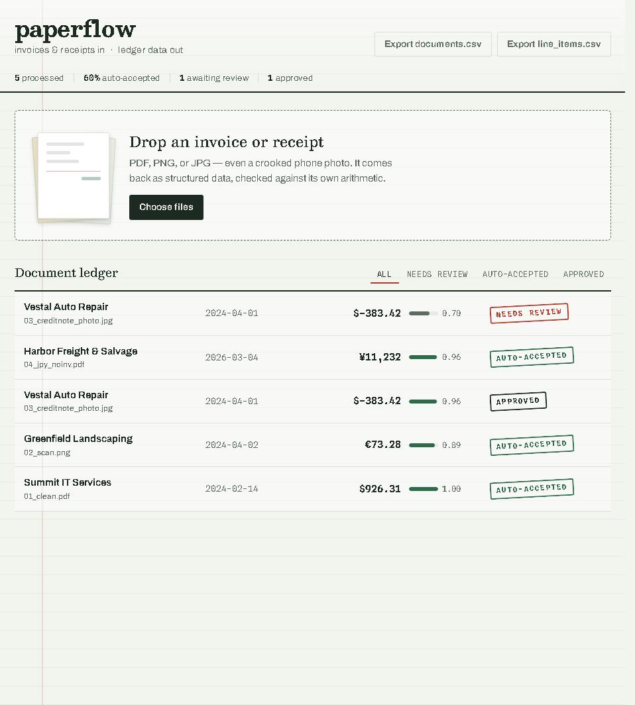
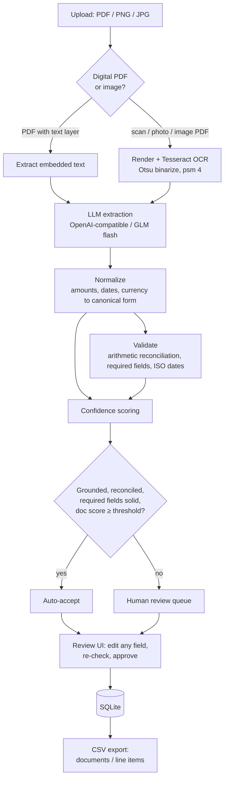
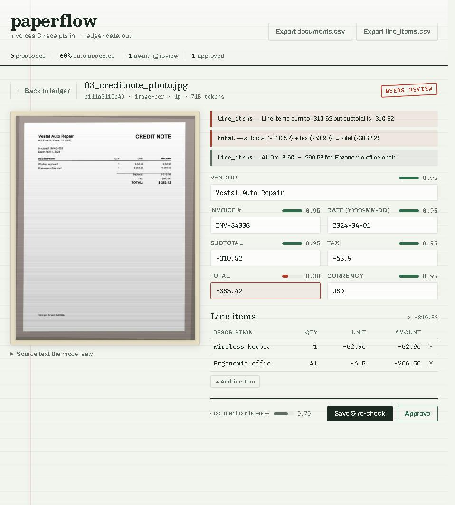

# paperflow

**Turn invoices and receipts into structured, verified ledger data — and know which ones a human still needs to check.**

paperflow is a document-extraction pipeline built around one idea: on a cheap, fallible model, the *pipeline* carries the reliability, not the model. It extracts the fields an accountant needs, checks them against the document's own arithmetic and against the source text, scores its own confidence per field, and routes only the shaky ones to a human. Everything runs on free GLM flash-tier models through any OpenAI-compatible endpoint.

It ships with the part most demos skip: **a real eval harness** that runs the pipeline over 118 generated documents — clean PDFs, scans, skewed phone photos, multi-page invoices, and deliberately nasty edge cases — and prints honest, reproducible accuracy numbers. Every number in this README came out of `python -m evals.run`; none are hand-picked.

[](https://github.com/lordbasilaiassistant-sudo/paperflow/actions/workflows/ci.yml)
&nbsp;·&nbsp; Python 3.11+ · FastAPI · SQLite · vanilla JS · MIT



---

## The problem

A bookkeeping team receives invoices as email PDFs, flatbed scans, and photos texted from a job site. Someone retypes each one into the accounting system. It's slow, it's error-prone, and the errors are expensive: a transposed total pays the wrong amount, a misread vendor pays the wrong company.

"Just use an LLM" gets you 90% of the way and then hurts you, because the failure mode is silent: a flash model will confidently return a clean-looking JSON object with a wrong number in it, and nothing downstream knows. The hard part isn't extraction — it's **knowing which extractions to trust**. That's what this project is about.

The design goal: **auto-accept the documents the pipeline can verify, and route the rest to a fast human review UI** — while measuring, honestly, how often "auto-accept" is actually right.

## Pipeline



Both the API (per upload) and the eval harness (per fixture) call the **same** `pipeline.process()`, so the eval measures exactly what production runs.

## Eval results

Run yourself with `python -m evals.run`. Corpus: 118 deterministic synthetic fixtures. Model: `glm-4.5-flash` (free tier), reasoning disabled. Numbers below are the actual last run.

**118 documents** · **94.8% field accuracy** · **78.0%** auto-accepted at **98.1%** accuracy · **11** material false accepts (12.0% of auto-accepted)

| Metric | Value |
|---|---|
| Documents scored | 118 |
| Overall field accuracy | 94.8% |
| Docs fully correct (every field exact) | 77/118 (65.3%) |
| Auto-accepted (no human) | 92 (78.0%), at 98.1% field accuracy |
| Sent to review | 26 (22.0%), at 82.9% field accuracy |
| **Material false accepts** (auto-accepted with a wrong vendor/date/amount/currency) | **11** (12.0% of auto-accepted) |
| False accepts incl. cosmetic (any field, e.g. an OCR-slipped description token) | 21 (22.8% of auto-accepted) |
| Tokens / doc | 868 |
| Cost / doc | $0.00000 (model priced at $0, free tier) |

**Field accuracy by document category**

| Category | n | Field accuracy | Fully correct | Auto-accept rate |
|---|---|---|---|---|
| clean_pdf | 30 | 100.0% | 30/30 | 100.0% |
| edge | 24 | 97.9% | 20/24 | 75.0% |
| multipage | 12 | 100.0% | 12/12 | 100.0% |
| photo | 24 | 82.3% | 2/24 | 50.0% |
| scan | 28 | 94.9% | 13/28 | 71.4% |

**Per-field accuracy**

| Field | Accuracy |
|---|---|
| vendor | 95.8% |
| date | 99.2% |
| invoice_no | 100.0% |
| subtotal | 79.7% |
| tax | 97.5% |
| total | 95.8% |
| currency | 94.9% |
| line_items | 95.4% |

Line-item attributes on matched rows: description 98.9%, quantity 92.9%, unit_price 96.2%, amount 96.7%. Subtotal (79.7%) and the photo category (82.3%) are the weak spots, and both are the same cause — OCR misreads on degraded images; all 24 subtotal misses are on scans/photos, none on digital PDFs.

**Auto-accept threshold tradeoff** — raising the confidence bar trades automation for fewer false accepts. There is no free 100%: the floor is genuine ambiguity (a `$` that could be USD or CAD) the model cannot resolve from the page.

| Threshold | Auto-accepted | Material false accepts |
|---|---|---|
| 0.80 (default) | 92 (78.0%) | 11 (12.0%) |
| 0.85 | 92 (78.0%) | 11 (12.0%) |
| 0.90 | 84 (71.2%) | 7 (8.3%) |
| 0.95 | 67 (56.8%) | 4 (6.0%) |

Reproduce with `python -m evals.run`; regenerate this table with `python -m evals.report_md`.

**How to read this.** Field accuracy is a strict, mechanical comparison to ground truth (exact match for text/date/currency, ±0.01 for amounts, per-attribute for line items). The number that matters for a bookkeeping workflow isn't raw accuracy — it's the **false-accept rate**: of the documents the pipeline auto-accepted without a human, how many were not actually 100% correct. That's the number that would cost a client money, and it's reported in full, with the offending document IDs.

### What the eval does and does **not** measure

Being honest about this is the whole point, so it gets its own section.

- **The corpus is synthetic.** Documents are generated with ReportLab and degraded programmatically (rotation, blur, JPEG noise, perspective skew for "photos"). This is *light* degradation on a clean render — it does **not** represent a crumpled thermal receipt photographed at 30° under bad lighting. Real-world OCR accuracy on hostile inputs will be lower than the "scan"/"photo" numbers here.
- **The eval's failure sources are real, not round-tripped.** An earlier version quietly guaranteed ~100% on dates and currency because the fixture generator only emitted formats the normalizer already knew, and ground truth was rendered by the same code path it was scored against. The failures you see now come from sources *independent* of the parser: OCR errors on degraded scans and photos (the "scan"/"photo" categories score well below clean PDFs), and genuine **currency ambiguity** — CAD is printed as a bare `$`, which the model cannot distinguish from USD, so those documents *miss on purpose*. Date formats the pipeline handles were deliberately widened rather than left as an artificial gap; the remaining date misses are OCR errors, not format gaps.
- **Not covered:** handwriting, stamps/overlays over text, non-Latin scripts (CJK), true multi-column table reflow, and VAT-breakdown/multi-tax layouts. These are real and hard; they're listed here rather than hidden.
- **Cost is reported at the model's list price**, which is `$0` on the free tier. The token counts are real; multiply by a paid model's per-token price to get a real cost (see [Cost](#cost)).

The eval was hardened after a multi-agent adversarial review of its own honesty found five ways it was flattering itself (self-fulfilling fixtures, amount-only line-item scoring, and a routing hole where an internally-consistent hallucination could auto-accept). See [failure modes](#failure-modes--handling).

### Why not 100%?

Because a portfolio that claimed 100% would be either overfit to its own eval or dishonest — and an experienced reviewer knows it on sight. A flash model reading a skewed phone photo of a receipt will make mistakes; the engineering question is not "can we be perfect" but **"do we know when we're not, and route those to a human before they cost anything."** The number that matters is the *material false-accept rate* — documents auto-accepted with a wrong vendor, date, amount, or currency — and the [threshold tradeoff](#eval-results) shows it can be dialed toward zero at the cost of auto-accepting fewer documents. The floor isn't laziness; it's genuine ambiguity (a `$` that could be USD or CAD) that no amount of model quality resolves from the page alone.

## How confidence and routing work

A flash model's self-reported confidence is a weak signal — these models are cheerfully overconfident, and the failure that matters most is a model returning a set of numbers that is *internally consistent but absent from the document*. So the confidence score never trusts self-report alone. It blends three signals:

1. **Model self-confidence** — a weak prior, per field.
2. **Source grounding** — does the extracted value actually appear in the document text? A total the model is sure of but that appears nowhere on the page is capped low. This is what stops a confident hallucination from being auto-accepted.
3. **Arithmetic corroboration** — line items reconciling to a subtotal/total is evidence the numbers agree with *each other*. It only boosts fields that are also grounded, and only for a *non-trivial* reconciliation (real line items, not a lone total equal to itself).

A document is **auto-accepted** only when its weighted score clears the threshold, no validation error is present, **and** the required fields (vendor, date, total) are each present, grounded in the source, and above a floor — so a high average from reconciling financials can't carry a wrong vendor over the line. Everything else goes to the review queue.



## Failure modes & handling

The interesting failures, and what the pipeline does about each. Several of these were found by running a multi-agent adversarial review against this repo's own code and eval.

| Failure mode | What happens | Handling |
|---|---|---|
| Model returns invalid JSON | flash models sometimes wrap JSON in prose or fences | balanced-brace extractor + one repair retry; unparseable → routed to review at confidence 0 |
| **Internally-consistent hallucination** | model invents wrong numbers that reconcile with each other | **source grounding**: values not found in the document text are capped low and can't auto-accept |
| OCR digit slip (e.g. subtotal 36.82 → 36.02) | one wrong number breaks reconciliation | arithmetic validation catches the mismatch → routes to review |
| Legit non-reconciling invoice (discount, shipping, tax-inclusive) | `subtotal + tax ≠ total` even though the read is correct | mismatch is a **warning, not an error** — routes to review rather than falsely asserting the extraction is wrong |
| European amount formats (`1.234,56`, `1.500`) | naive parsing divides by 1000 or drops the value | locale-aware separator resolution (fixed three 1000× bugs found in review) |
| Ambiguous date `05/06/2024` | US vs European order silently disagree | currency drives day-first vs month-first; genuinely ambiguous cases documented as a known limit |
| Currency printed as bare `$` when it's CAD | model reads USD | genuine ambiguity — this **misses** in the eval rather than being hidden; it's the floor on the false-accept rate |
| Unparseable / unknown date format | normalizer can't produce ISO | date left unnormalized → `bad_date` → routed to review (never stored as a wrong guess) |
| Rate-limited free-tier LLM | 429s under load | exponential backoff with jitter, honors `Retry-After`; native OCR calls serialized to stay thread-safe |

## Cost

The eval prints tokens/doc and cost/doc. On the free GLM tier the dollar cost is `$0`; the token count is the real, portable number.

On this corpus the pipeline uses **~868 tokens/document** (one extraction call, mostly the document text as input). At `glm-4.5-flash` free-tier pricing that's **$0.00/doc**. For scale planning, at a representative paid flash-tier price of ~$0.10 / 1M input tokens that's roughly **$0.0001/doc — about $1 per 10,000 documents**, before any batching or caching. The token count is what's real and portable; the dollar figure is whatever your endpoint charges.

To see real dollars, set `LLM_PRICE_INPUT_PER_M` / `LLM_PRICE_OUTPUT_PER_M` in `.env` to a paid model's list price and re-run — the harness does the arithmetic. Extraction is a single chat call per document (two if the first response isn't valid JSON), so cost scales linearly with volume and is dominated by input tokens (the document text).

## What I'd change at 10× volume

This is built to be read, not to survive a million documents a day. At 10× I'd change, in rough priority order:

1. **Queue the pipeline, don't block on it.** Uploads currently process in a FastAPI background task. At volume that becomes a worker pool (Celery/RQ or a cloud queue) with the LLM call as the throttled resource, so rate limits are handled by the queue instead of per-request backoff.
2. **Cache and dedupe.** Hash each document; identical re-uploads (common in AP workflows) skip extraction entirely.
3. **Batch OCR off the request path.** Tesseract is CPU-bound and currently serialized for thread-safety; at volume it moves to a dedicated OCR service (or a GPU OCR model) with real concurrency.
4. **Learn the threshold, per vendor.** The auto-accept threshold is a single constant. With labeled review outcomes it becomes a calibrated, per-vendor decision — a vendor whose layout the pipeline reads perfectly earns a higher auto-accept rate over time.
5. **A stronger model for the routed tail only.** Keep flash for the 60-ish% that auto-accept; escalate just the review-queue documents to a vision model, so spend follows difficulty.
6. **Postgres, not SQLite**, once there's more than one writer.

## Quickstart

Requires Python 3.11+ and Tesseract (for scans/photos; digital PDFs work without it).

```bash
git clone https://github.com/lordbasilaiassistant-sudo/paperflow.git
cd paperflow
python -m venv .venv && . .venv/bin/activate      # Windows: .venv\Scripts\activate
pip install -r requirements.txt

cp .env.example .env                               # then add your key
# LLM_API_KEY=...   (any OpenAI-compatible endpoint; defaults target z.ai's free GLM)

uvicorn app.main:app --reload                      # open http://127.0.0.1:8000
```

Drag an invoice onto the page. To see the eval:

```bash
pip install -r requirements-dev.txt
python -m evals.generate       # build the fixture corpus
python -m evals.run            # run the pipeline over it and print the report
```

Installing Tesseract: [UB-Mannheim build](https://github.com/UB-Mannheim/tesseract/wiki) on Windows, `apt install tesseract-ocr` on Debian/Ubuntu, `brew install tesseract` on macOS. Point `TESSERACT_CMD` at the binary in `.env` if it isn't on `PATH`.

## Project layout

```
app/
  ingest.py       PDF text extraction + OCR fallback (Otsu binarize, thread-safe)
  extract.py      LLM call, JSON extraction with repair retry
  normalize.py    amounts / dates / currency -> canonical form
  validation.py   arithmetic reconciliation + required-field checks
  confidence.py   per-field scoring, source grounding, auto-accept vs review routing
  pipeline.py     ingest -> extract -> validate -> score (shared by API and eval)
  main.py         FastAPI: upload, review, approve, CSV export
  static/         vanilla-JS review UI, no build step
evals/
  gen_data.py     synthetic invoice data (seeded, deterministic)
  render.py       data -> PDF, and PDF -> scan/photo degradation
  score.py        strict field + line-item-attribute scoring
  generate.py     builds the 118-fixture corpus + ground truth
  run.py          runs the pipeline over the corpus, prints the report
tests/            unit tests for normalize / validate / confidence / parsing / export
```

## Testing

```bash
pytest          # unit tests: parsing, validation, confidence routing, export
ruff check .    # lint
```

CI (GitHub Actions) runs lint, the unit tests, and a 10-document eval subset on every push.

## Non-goals

Deliberately out of scope — this is a portfolio pipeline, not a product. Each of these is where "production hardening for a client" would begin:

- **Auth, multi-tenancy, per-user data isolation** — there is no login; all data is local.
- **Billing / metering.**
- **ERP / QuickBooks / Xero integrations** — export is plain CSV.
- **Contracts, POs, statements, and other document types** — invoices and receipts only.
- **A managed OCR/vision service** — local Tesseract only.

## License

MIT — see [LICENSE](LICENSE).

---

<sub>paperflow runs on free GLM flash-tier models through any OpenAI-compatible endpoint. If you want a larger GLM quota for your own agents, the [z.ai Coding Plan](https://z.ai/subscribe?ic=BWTG6TRYYQ) is what I use — that's a referral link, and it helps fund my compute. Any OpenAI-compatible endpoint works just as well; nothing here is locked to a provider.</sub>
